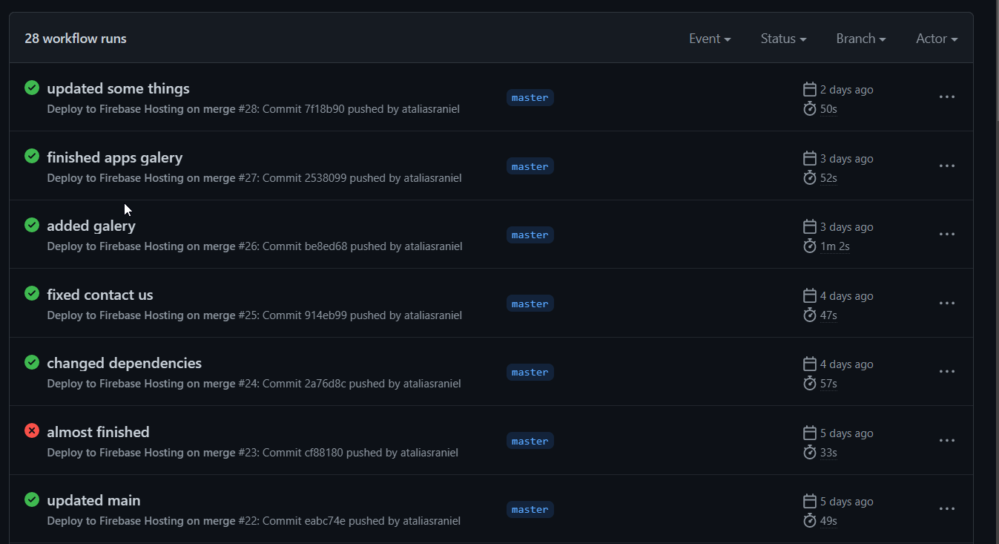
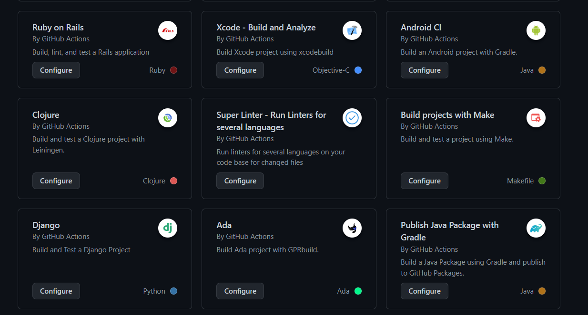
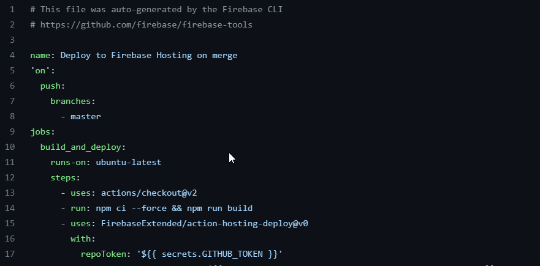
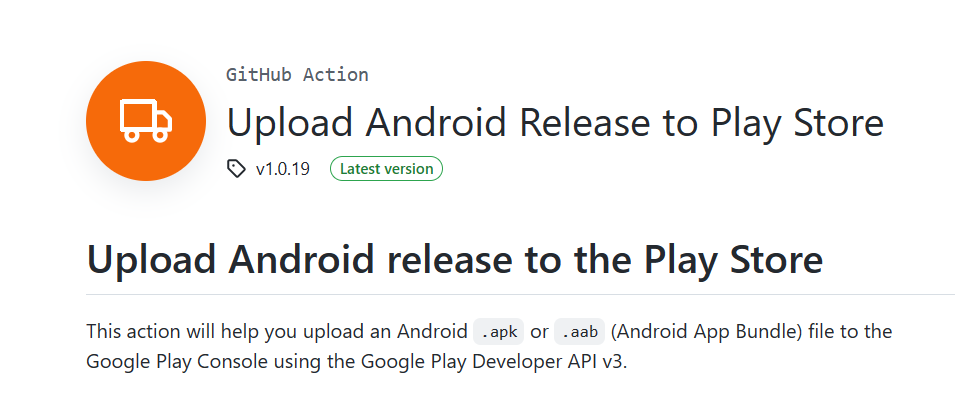
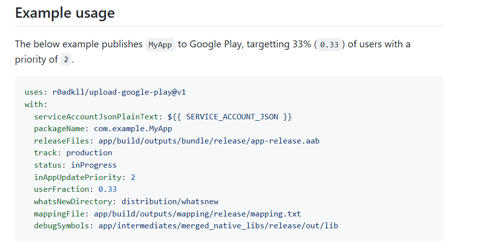
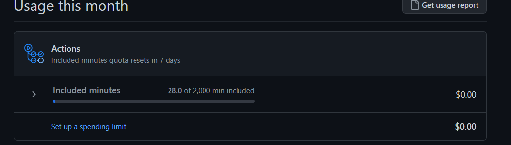

<style>
  @import url('https://fonts.googleapis.com/css2?family=Chivo+Mono&display=swap');
  *{
    font-family: 'Chivo Mono', monospace;
  }
  section{
    height: auto;
    display: flex;
    flex-direction: column;
    align-items: center;
    justify-content: center;
  }
  .heading{
    font-size: 12rem;
  }
  h1{
    color: red;
  }
 .fullHeight{
  height: 100vh;
 }

</style>


<section class='fullHeight'>

# Github Actions
# &
# CI & CD

</section>

---

<section class='fullHeight'>

# O que é?
🤔
- Automatização de Fluxos diretamente do repositório
- Integração com sdks de produção como no Firebase, AWS, composer etc
- Integração com CIs & CDs
- Personalização de Jobs (scripts)

</section>

---
<section class='fullHeight'>

# Uma ressalva 👍
GitHub Actions não é exatamente uma ferramenta de CI, CD. Ele é mais voltado para integrações com terceiros, inclusive com outras ferramentas de CI e CD como o Circle CI. GitHub Actions é mais voltado para ajudar na __integração com esses serviços__, sendo a ponte entre o desenvolvimento e ferramentas de CI & CD de terceiros como o Firebase Hosting, Firebase App Distribuition, Testings etc 

</section>
---


<section class='fullHeight'>

# Como funciona? 😮

- Github funciona com __Trigger Events__, ao subirmos, criar novas branches etc, é disparado um evento, esse evento, podemos dar certos triggers, por exemplo: ao criar um novo pull request ou um novo commit, podemos rodar um *Script que roda os testes unitários no código, ou até mesmo subir diretamente para a Google Play ou Serviço de Hospedagem* 
  <br/>
 
- Os scripts usam __Sintaxe YAML__ para construir as instruções de serviços
  <br/>
  ```YAML
  valor: chave
  outroValor:
    outraChave: assim
    vai: e tal
  ``` 

 <br/>
- Dessa forma, é muito mais simples para os desenvolvedores e empresas cuidarem de muitos workflows de produção e entregas contínuas, como por exemplo **testes automatizados, publicação automática ao passar nos testes, publicação contínua com delivery incremental etc**

</section>

<section>

# Como fazer ⚒️
Todo repositório do github apresenta uma aba de "actions", onde ficarão todos os fluxos de automação


Os jobs aparecerão dessa forma, com os seus respectivos Status


Ao clicar em "New Workflow", ou seja, criar um novo fluxo, aparecerá uma tela para você já começar com alguns templates ou fazer o próprio. Vale lembrar, porém, que a melhor alternativa vai ser sempre usar um dos templates já prontos, pois alguns serviços como a AWS, Composer do PHP etc já tem um fluxo preparado como no exemplo:



Os jobs são criados com .YAML. No exemplo abaixo, o script que faz com que ao fazer um novo push, o job roda um comando NPM para pegar as dependências do projeto, rodar um build e assim que terminar, faz a publicação para o __Firebase Hosting__


Um exemplo de script que roda os testes de uma API feita em NodeJS
```YAML
name: Node.js CI

on:
  push:
    branches: [ main ]
  pull_request:
    branches: [ main ]

jobs:
  build:

    runs-on: ubuntu-latest

    strategy:
      matrix:
        node-version: [10.x, 12.x, 14.x, 15.x]

    steps:
      - uses: actions/checkout@v3
      - name: Use Node.js ${{ matrix.node-version }}
        uses: actions/setup-node@v3
        with:
          node-version: ${{ matrix.node-version }}
      - run: npm ci
      - run: npm run build --if-present
      - run: npm test
```


</section>
---

<section>

# Um exemplo em Flutter 🤳

Para flutter, há alguns [Scripts no próprio marketplace do GitHub](https://github.com/r0adkll/upload-google-play) para rodar essas integrações. No caso, precisamos também ter uma Acces Key no Google Cloud Platform, para setar o CI e termos a permissão de mandar o **Appbundle diretamente para a loja**. Com a Access Key, podemos colocá-la no **SECRETS** do repo no GitHub. 


Exemplo de Script que faz o deploy para o Google Play **na variável ```serviceAccountJsonPlainText``` é onde fica o SecretKey que pegamos do Google Cloud**
<!--  -->


```YAML
uses: r0adkLL/upload-google-play@v1
with:
  serviceAccountJsonPlainText: ${{SERVICE_ACCOUNT_JSON}}
  packageName: com.example.myApp
  releaseFiles: app/build/outputs/bundle/release/app-release.aab
  track: production
  status: inProgress
  inAppupdatePriority: 2
  userFraction: 0.33
  whatsNewDirectory: distribuition/whatsnew
  mappingFile: app/build/outputs/mapping/release/mapping.txt
  debugSymbols: app/intermediate/merged_native_libs/release/out/lib
```
Ao analizarmos, vemos que muita coisa é preparada para o lançamento automático: mappingFile, whatsNew, release files etc

<br/>

Outro exemplo mais comum, é usar o __App Distribuition do Firebase__ para distribuir builds novas gradativamente aos usuários, ao mesmo tempo que coleta novas informações de builds, isso é útil porque evita que tenhamos bugs de produção em larga escala. Nesse serviço, o Actions é ótimo porque pode fazer automaticamente também


</section>
---

---
<section class='fullHeight'>

# Alternativas ao GitHub Actions (pagas)
[Code magic](https://codemagic.io/start/)
[BitRise](https://bitrise.io/?utm_source=google&utm_medium=cpc&utm_campaign=conversion-focus&utm_source=google&utm_medium=cpc&utm_campaign=US-S-Platform&utm_term=Android_Androidbuild&gclid=CjwKCAiAnZCdBhBmEiwA8nDQxS2pb8bj5YInX9DF3wEVMl7eD-cENW-lqg421YgCMCYD9prztlas1RoC_mkQAvD_BwE&gclsrc=aw.ds)

Também vale lembrar que o GitHub Actions não é totalmente free, temos um limite mensal de uso, no caso 2000 minutos. É válido também dizer que essas outras ferramentas não substituem completamente o Actions, mas podem ser uma extensão de suas funcionalidades, o que pode ser ótimo ao usar em conjunto.
<br/>


</section>


---
<section class='fullHeight'>

# THE END 👌

</section>
---